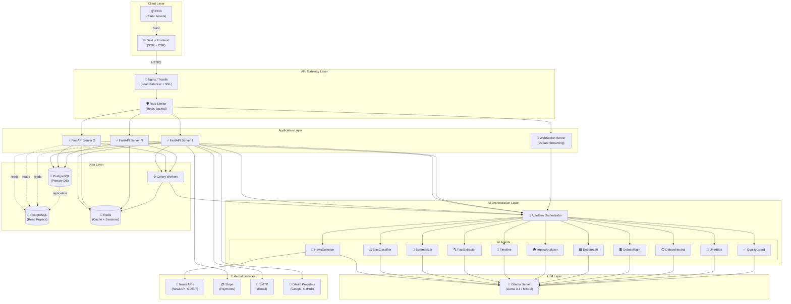
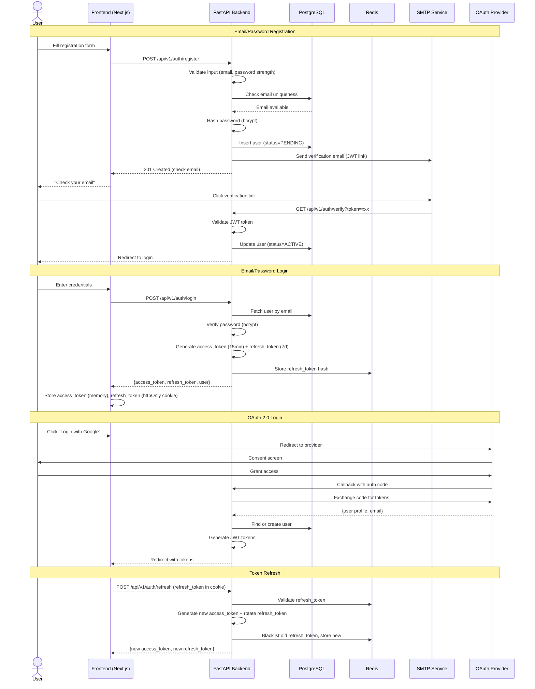
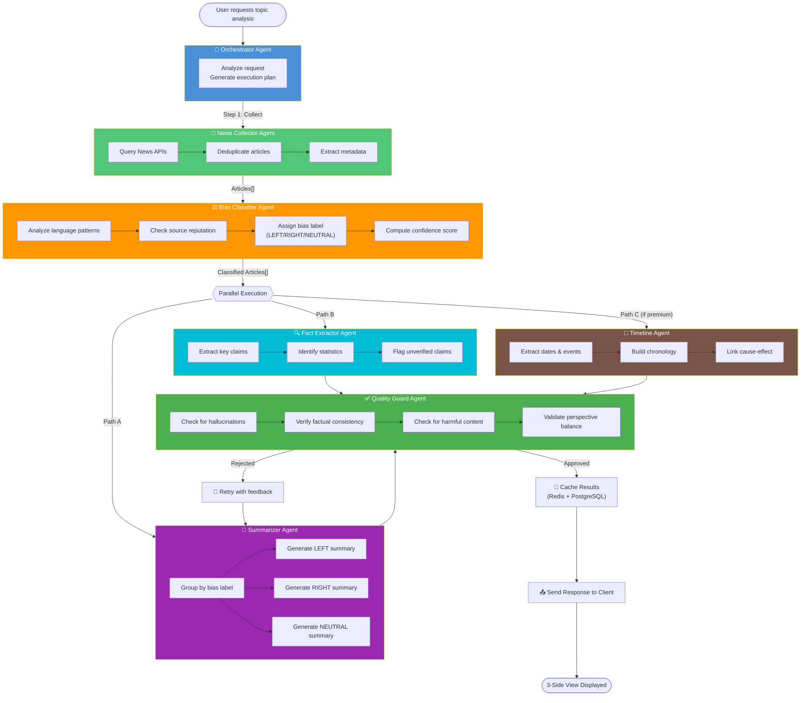
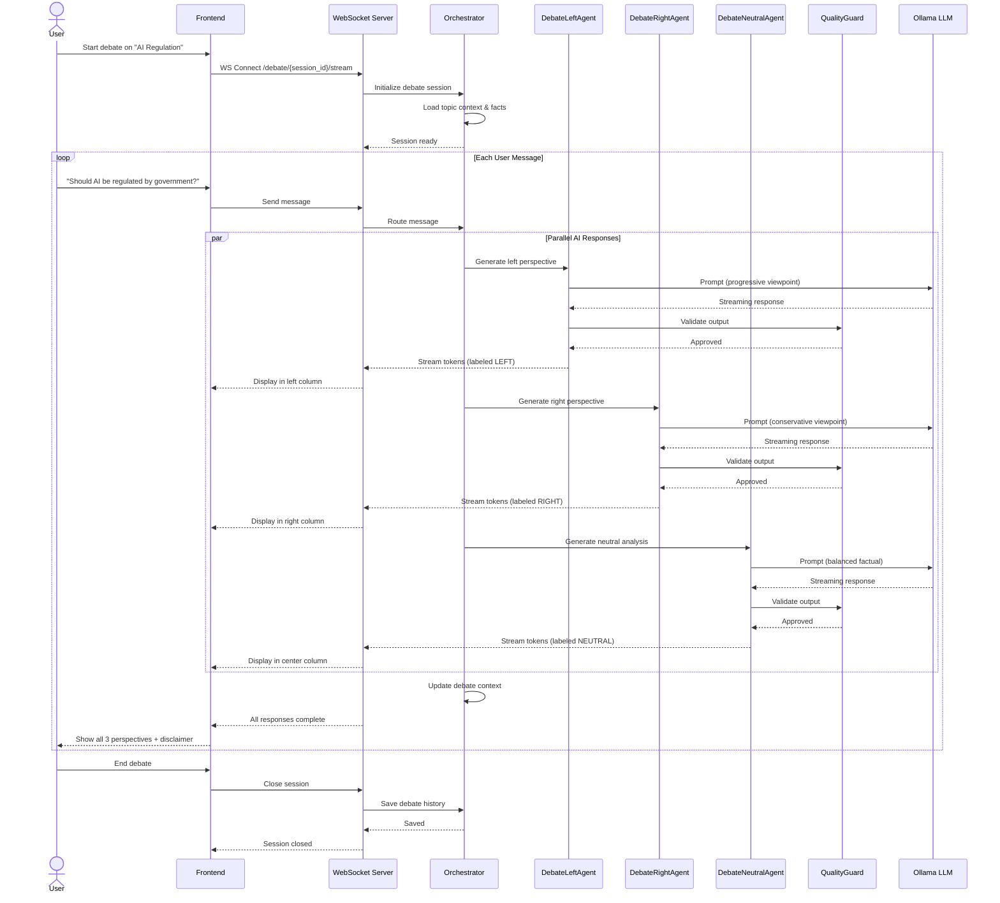
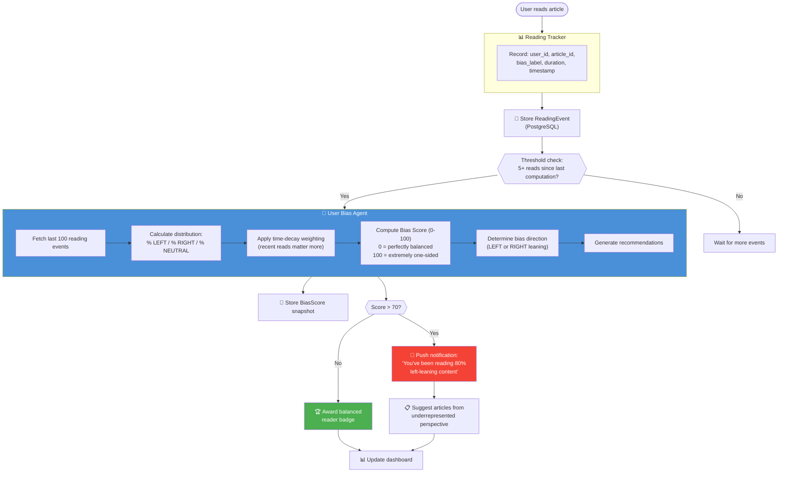
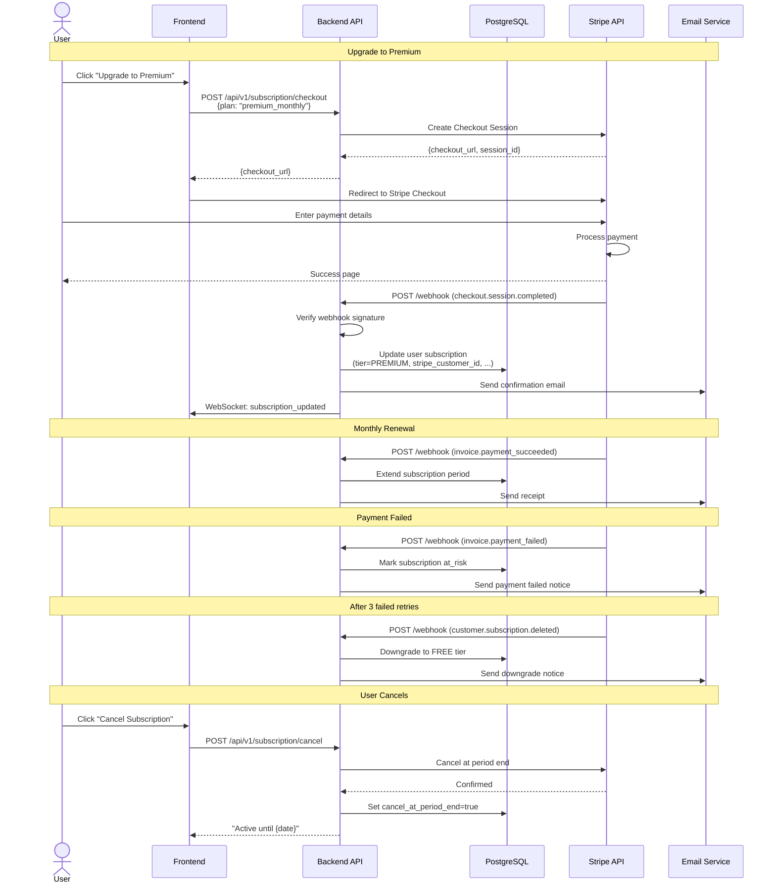
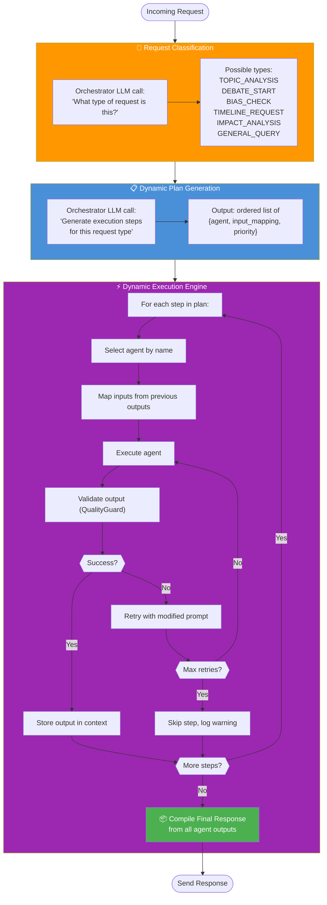
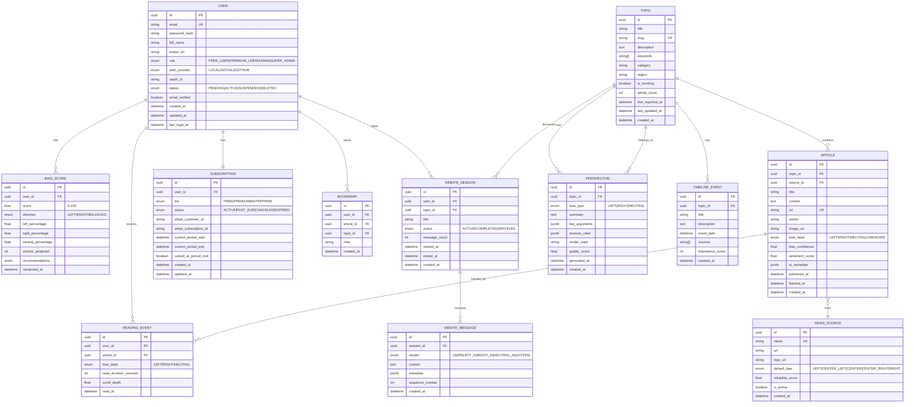
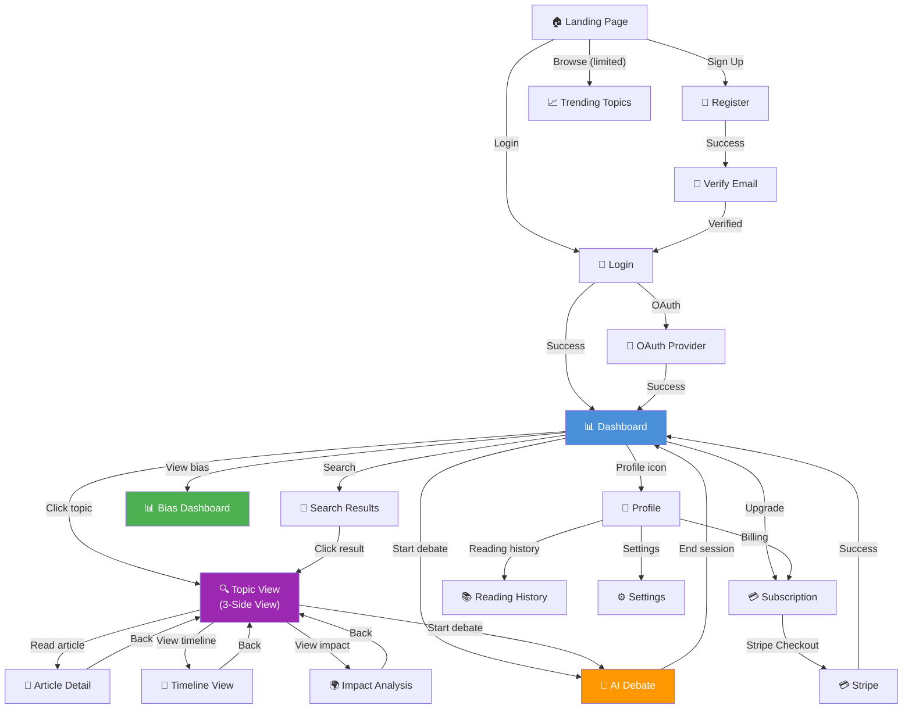
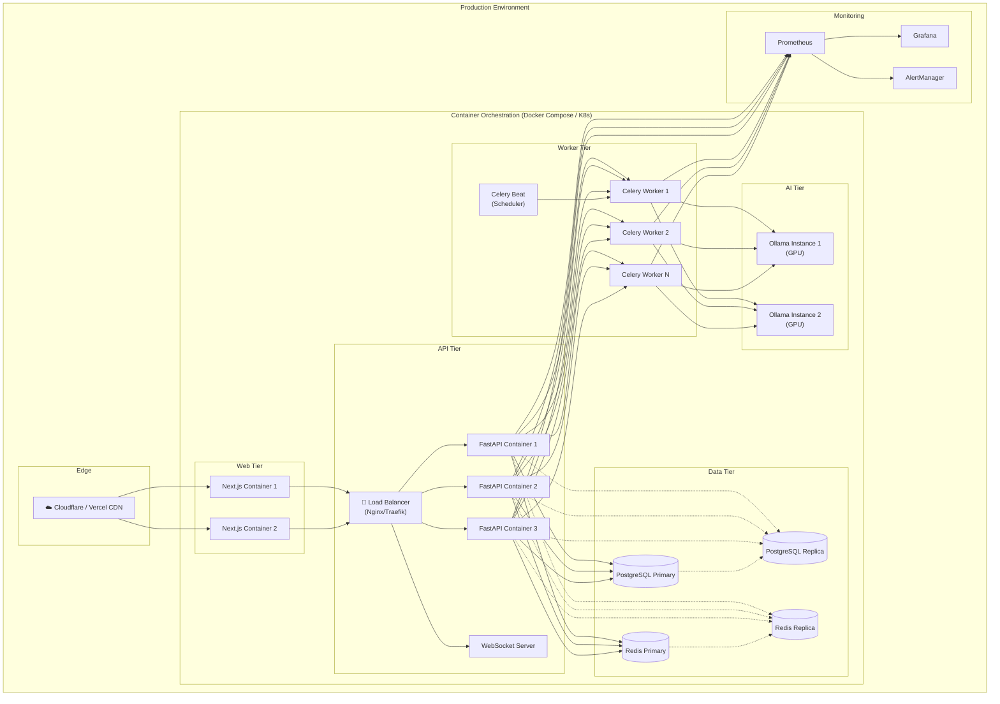

# Architecture & Flow Diagrams
## BothSidesOfACoin

---

## 1. High-Level System Architecture

---

## 2. User Authentication Flow

---

## 3. News Analysis Pipeline Flow

---

## 4. AI Debate Mode Flow

---

## 5. Bias Detection & Scoring Flow

---

## 6. Subscription & Payment Flow

---

## 7. AutoGen 0.4 Dynamic Agent Orchestration Flow

---

## 8. Database Entity Relationship Diagram

---

## 9. Frontend Page Navigation Flow

---

## 10. Deployment Architecture

